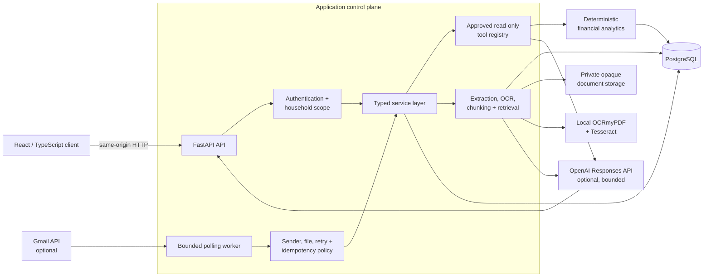
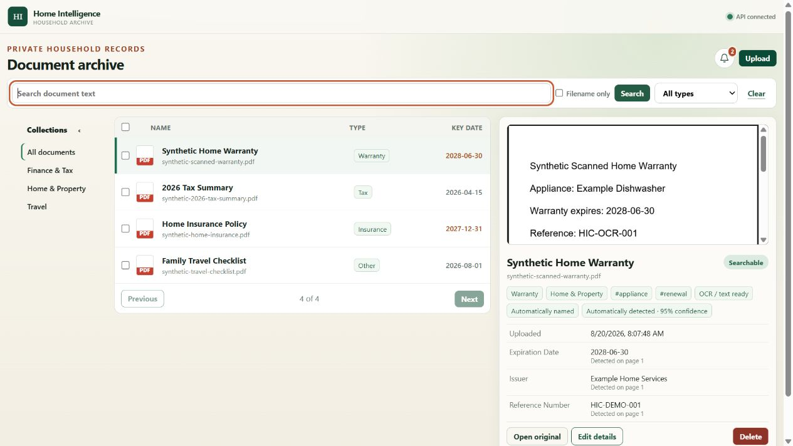
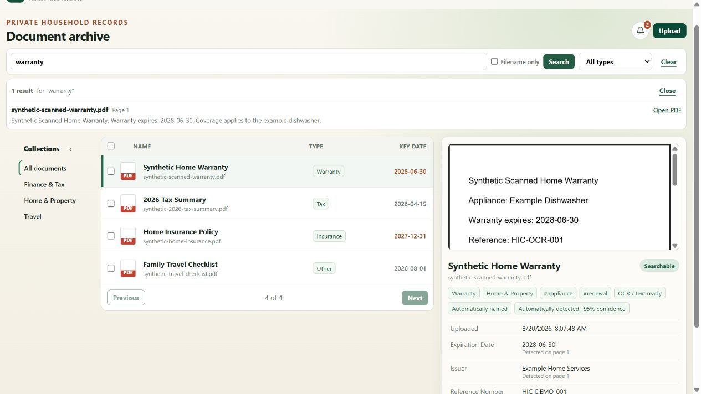

# Home Intelligence Copilot

Home Intelligence Copilot (HIC) is a private, single-household application for organizing household documents and answering questions from them with traceable evidence. It also contains a feature-flagged financial workspace for normalizing statement exports and producing deterministic spending analytics.

The engineering goal is to put deterministic services, explicit authorization, provenance, and evaluation around AI—not to let a model become the system of record or calculate financial facts from unstructured prompts.

## Why this exists

Household information is usually fragmented across email, PDFs, downloads, and bank exports. Finding a warranty date, tracing an answer to the correct document, or reconciling spending often requires manual search and repeated spreadsheet work. HIC explores a maintainable architecture for:

- ingesting private documents through bounded, auditable workflows;
- extracting native or scanned PDF text locally;
- retaining page-level provenance through indexing and answers;
- calculating financial results in deterministic code;
- using an LLM only inside narrow, testable contracts; and
- isolating every sensitive operation to an authenticated household.

## Implemented today

### Document intelligence

- Private PDF ingestion with type, size, page-count, checksum, duplicate, and active-content controls.
- Opaque filesystem storage with metadata in PostgreSQL; original filenames never determine storage paths.
- Native PDF extraction with page-selective local OCR using OCRmyPDF and Tesseract.
- Deterministic metadata classification, title inference, structured facts, key dates, and expiration reminders.
- Provenance-preserving chunks and ranked PostgreSQL lexical retrieval.
- Optional cited document answers with bounded context, source-instruction filtering, strict claim schemas, server-rendered citations, and numeric grounding checks.
- Document archive UI with preview, collections, tags, bulk upload/organization/deletion, and scoped questions.
- Optional Gmail polling worker for allowlisted PDF attachments, with OAuth, authenticated-sender checks, idempotency, bounded retries, and redacted ingestion history.

### Financial intelligence

- Atomic CSV import for canonical, Citi credit-card, Chase credit-card, and Bank of America account formats.
- Normalized transactions and import provenance using `Decimal`/PostgreSQL `NUMERIC` for money.
- Import history, transaction queries, deletion, duplicate review, and deterministic categorization.
- Deterministic spending totals, category breakdowns, period comparisons, and large-transaction queries.
- A provider-independent registry of four read-only analytics tools.
- Optional OpenAI Responses API orchestration that permits at most one validated tool call and checks the final explanation against authoritative tool output.
- A feature flag that can remove the financial workspace and its API surface from a document-first deployment.

### Security and reliability

- Application-managed owner authentication with Argon2id password hashes.
- Opaque server-side sessions, CSRF protection, Origin/Host validation, expiry, revocation, and login throttling.
- Non-null household ownership and server-derived household scoping across sensitive tables and services.
- Synthetic-only fixtures and evaluation datasets; generated reports and private files are ignored by Git.
- Versioned Alembic migrations, strict mypy, Ruff, Pytest, Vitest, Testing Library, ESLint, and production builds.
- Synthetic AI and RAG evaluation runners covering routing, grounding, refusals, citations, conflicts, and prompt-injection cases.

## Architecture



The API handlers validate transport concerns and delegate business rules to services. PostgreSQL is the system of record. AI providers receive only bounded questions and minimized evidence; they never receive database sessions, credentials, unrestricted queries, or mutation tools.

More detail: [architecture](docs/ARCHITECTURE.md), [security threat model](docs/SECURITY_THREAT_MODEL.md), [AI orchestration](docs/AI_ORCHESTRATION.md), and [document answer contract](docs/DOCUMENT_ANSWERS.md).

## Technology stack

| Layer | Technologies |
| --- | --- |
| Web | React 19, TypeScript, Vite |
| API | Python 3.12, FastAPI, Pydantic Settings |
| Persistence | PostgreSQL 16, SQLAlchemy 2, Alembic, psycopg |
| Documents | pypdf, OCRmyPDF, Tesseract, private filesystem blobs |
| AI | OpenAI Responses API behind optional controlled adapters |
| Quality | Pytest, HTTPX, Ruff, strict mypy, Vitest, Testing Library, ESLint |
| Runtime | Docker Compose; Caddy/reverse-proxy production profile |

## Key engineering decisions

- **Deterministic facts, generated explanations.** SQL and typed Python services calculate money and retrieve evidence; models explain validated results.
- **`Decimal` and `NUMERIC` for money.** Floating-point values are rejected at contract boundaries.
- **Provider-independent tools.** Strict read-only tool schemas are separate from the OpenAI adapter and revalidated before execution.
- **Provenance is carried forward.** Imports retain adapter/version/source context; document chunks retain document, extraction, page, offset, and checksum identity.
- **Fail closed at trust boundaries.** Unknown CSV formats, unsafe PDFs, ungrounded model claims, fabricated citations, and invalid tool calls are rejected.
- **Local OCR before cloud OCR.** Sensitive PDFs can be processed without sending their content to a separate OCR provider.
- **Synthetic repository data only.** Real household statements, documents, credentials, and derived reports are excluded from source control.
- **Thin routes, service-owned policy.** Parsing, validation, persistence, analytics, retrieval, and orchestration live outside HTTP handlers.

The complete decision log is in [docs/DECISIONS.md](docs/DECISIONS.md).

## Reliability and testing approach

Tests focus on business and trust-boundary behavior rather than an arbitrary coverage target:

- transaction atomicity, decimal precision, adapter detection, rollback, and duplicates;
- authentication, household isolation, CSRF, rate limits, and redacted audit behavior;
- PDF safety, storage compensation, extraction retry, OCR, provenance, and deletion;
- retrieval ranking, citation identity, numeric grounding, conflicts, and injection resistance;
- tool selection, strict arguments, refusal/clarification paths, and provider failures; and
- frontend workflows, accessibility checks, API error states, and production compilation.

Schema changes are migration-tested against PostgreSQL and checked for Alembic drift. AI behavior has separate versioned synthetic evaluation suites so model, prompt, tool-contract, and dataset changes can be assessed without household data.

## Interface

All interface images use independently created synthetic household data.

### Document archive

The document-first workspace combines collections, normalized metadata, extracted facts, key dates,
an inline PDF preview, and lifecycle actions without exposing private blob paths.



### Provenance-aware document search

Lexical search returns a bounded excerpt, the synthetic source filename, and its page number while
keeping the selected document and extracted metadata visible for verification.



## Run locally

### Prerequisites

- Docker Desktop with Docker Compose
- Node.js 24 and npm 11
- Optional for host-only backend development: Python 3.12

### 1. Configure placeholders

From the repository root:

```powershell
Copy-Item .env.example .env
Copy-Item frontend/.env.example frontend/.env.local
```

Replace `POSTGRES_PASSWORD` and the matching password in `DATABASE_URL` with a local-only value. Leave `AUTH_MODE=local`, `AI_ENABLED=false`, and `GMAIL_INGESTION_ENABLED=false` for the shortest local setup. Never commit `.env`.

### 2. Start PostgreSQL and the API

```powershell
docker compose up -d --build db api
docker compose exec api python -m alembic upgrade head
Invoke-RestMethod http://localhost:8000/health
```

The API is at `http://localhost:8000`. In development, OpenAPI is at `http://localhost:8000/docs`.

### 3. Start the web client

```powershell
cd frontend
npm ci
npm run dev
```

Open `http://localhost:5173`. Use the synthetic files under `sample-data/` for demonstrations. Set `FINANCIAL_FEATURES_ENABLED=true` in `.env` and restart the API when the financial workspace is needed.

### Optional secure owner mode

After migrations, create the owner interactively from `backend/`:

```powershell
python -m app.cli create-owner --login owner --household-name "Home household"
```

Then set `AUTH_MODE=secure` and use a same-origin TLS deployment. Passwords are read from hidden input, not command arguments. See [authentication architecture](docs/AUTHENTICATION_ARCHITECTURE.md) before exposing the application beyond a trusted local environment.

### Optional AI and Gmail integrations

Both integrations are disabled by default and require credentials only in the ignored `.env` file:

- [Controlled AI orchestration](docs/AI_ORCHESTRATION.md)
- [Gmail document ingestion](docs/GMAIL_DOCUMENT_INGESTION.md)

## Validate

Backend, from `backend/` with `.[dev]` installed:

```powershell
python -m pytest
python -m ruff check .
python -m ruff format --check .
python -m mypy .
python -m alembic check
```

Frontend, from `frontend/`:

```powershell
npm test
npm run lint
npm run typecheck
npm run build
npm audit --audit-level=high
```

Synthetic AI/RAG release gates, from `backend/`:

```powershell
python scripts/run_ai_evaluation.py --output ai-evaluation-report.json
python scripts/run_rag_evaluation.py --output rag-evaluation-report.json
```

Generated reports are ignored by Git and must not contain real household data.

## Current boundaries

- V1 is an owner-operated, single-household system; it is not a multi-tenant SaaS product.
- Document support is PDF-only. OCR is local and does not guarantee handwriting or complex-layout accuracy.
- Retrieval is PostgreSQL lexical search, not embeddings or vector search; the evaluation suite has not yet justified that additional complexity.
- Model use is optional and read-only. There are no autonomous mutation agents or multi-agent workflows.
- Gmail intake is opt-in polling for one configured mailbox/household, not Pub/Sub push or a mailbox-management product.
- Production deployment still requires operator-managed TLS, encrypted storage/backups, monitoring, patching, and recovery exercises.

## Future direction

The next enterprise-AI evolution should build on the existing control plane rather than bypass it:

1. **Policy-based domain routing:** route a question to document retrieval, deterministic analytics, or clarification before invoking a model; record the decision and policy version.
2. **Durable orchestration and approvals:** persist workflow steps and checkpoints so future mutation tools require an explicit human approval and can resume safely after failure.
3. **Operational AI observability:** add privacy-safe traces for retrieval, tool calls, latency, token use, model/prompt versions, refusals, and evaluation outcomes.

Potential embeddings, reranking, additional document types, and multi-agent roles should be introduced only when synthetic evaluation demonstrates measurable value. See [docs/ROADMAP.md](docs/ROADMAP.md) for the milestone history.

## Repository map

```text
backend/       FastAPI application, migrations, services, tests, evaluation runners
frontend/      React/TypeScript workspace and component/API tests
docs/          Product, architecture, security, decisions, roadmap, and runbooks
sample-data/   Independently created synthetic fixtures only
compose.yaml   Local PostgreSQL/API development environment
```

## License

Released under the [MIT License](LICENSE).
