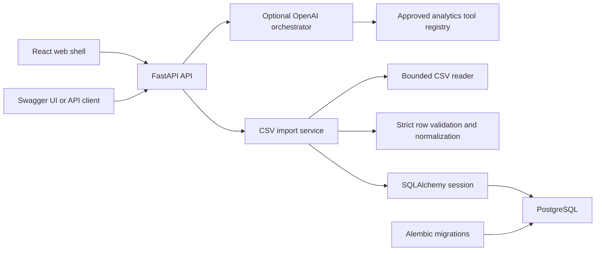
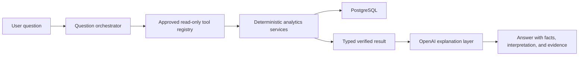
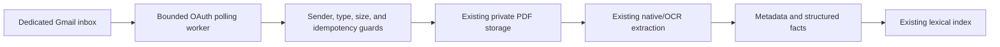

# Home Intelligence Copilot Architecture

This document separates the architecture that exists today from components proposed for future milestones.

## Existing architecture

### System overview



### Components

| Component | Status | Responsibility |
| --- | --- | --- |
| FastAPI application | Existing | Creates the application, registers routers, validates HTTP inputs, and exposes OpenAPI/Swagger UI. |
| React web client | Existing | Provides an accessible responsive login/session gate, CSV upload/results, import history/detail, filtered transactions with inline category management and exact backend totals, and a private document archive with metadata editing, search, authorized original access, and citation links; it does not parse or calculate financial data. |
| Vite frontend toolchain | Existing | Provides the TypeScript build, local /api proxy, development server, Vitest environment, and optimized static bundle. |
| PostgreSQL 16 | Existing | System of record for financial records plus private-document metadata and lifecycle state; original PDF bytes remain outside the database. |
| SQLAlchemy 2 | Existing | Declarative models, relationships, constraints, indexes, sessions, and unit-of-work boundaries. |
| Alembic | Existing | Versioned PostgreSQL schema creation and drift checking. |
| Pydantic Settings | Existing | Environment-based application, database, CSV/document limits, authentication, and optional bounded OpenAI configuration. |
| Authentication service | Existing | Bootstraps/recover owners interactively, verifies Argon2id credentials, issues/revokes opaque digest-only sessions, rotates CSRF tokens, rate-limits login, and records redacted security outcomes. |
| Household scope guard | Existing | Derives the household from the server principal, injects global ORM criteria, assigns/checks non-null ownership, and denies cross-household parent relationships and writes. |
| CSV reader | Existing | Reads bounded UTF-8 CSV content with strict CSV parsing. |
| Import service | Existing | Validates headers and rows, normalizes fields, computes counts/status, records canonical adapter provenance and an optional safe account label, and persists atomically. |
| Adapter layer | Existing | Defines versioned identities, strict canonical date/Decimal rows, reviewed header locations, explicit metadata-row exclusions, mutually exclusive detection outcomes, and strict version `1` adapters for canonical, Citi credit-card, Chase credit-card, and Bank of America account CSVs. |
| Private document storage | Existing | Stages and atomically promotes PDF originals under server-generated opaque keys; rejects traversal and symlink paths; supports idempotent deletion. |
| Document ingestion service | Existing | Streams and bounds PDF uploads, validates structure/encryption/pages, permits only bounded `http`/`https`/`mailto` URI link annotations, rejects executable or automatic actions/forms/embedded content, computes SHA-256, persists safe metadata with compensation, and performs deny-first audited deletion. |
| Document extraction service | Existing | Verifies stored source size/SHA-256, dispatches a versioned native-PDF extractor, bounds text, persists page/section spans atomically, and manages visible processing/failure/retry state. |
| Document metadata classifier | Existing | Uses versioned deterministic rules over safe PDF title metadata, descriptive filenames, and extracted native/OCR text for household, employment, immigration, legal, medical, education, correspondence, and receipt types; persists confidence and non-sensitive evidence; applies only non-user-managed title/type fields without external calls. |
| Structured document facts | Existing | Extracts five explicitly labeled fact types from page spans, stores extraction/page/rule provenance, protects user overrides and clears, and exposes deterministic expiration state from a caller-supplied date. |
| Document expiration reminders | Existing | Stores one opt-in in-app configuration per document and derives household-timezone attention state with acknowledgement tied to a specific expiration date and deterministic snooze. |
| Transaction query service | Existing | Applies bounded filters, loads category-assignment provenance, and returns stable newest-first pages plus exact spending, income, net, and gross totals across the full active result set. |
| Import-batch query service | Existing | Lists batch provenance, outcome counts, and timestamps with bounded status-filtered pagination; retrieves one batch with an authoritative persisted transaction count. |
| Spending analytics service | Existing | Applies semantics version 1.0 filters; calculates exact gross-spending summaries and category groups with SQL `NUMERIC` aggregation; derives percentages using `Decimal`. |
| Analytics tool registry | Existing | Exposes four immutable, provider-independent, read-only contracts that validate explicit arguments and return the same typed deterministic results as the analytics routes. |
| OpenAI orchestrator | Existing | Resolves the exact relative period “last month” from a validated household timezone, optionally sends the bounded question to the Responses API, accepts at most one strict allowlisted tool call, executes it through the household-scoped deterministic registry, minimizes provider evidence, and rejects ungrounded numeric claims. |
| Categorization service | Existing | Stores categories/rules/current provenance; performs normalized exact/prefix/contains matching with priority/UUID precedence; protects manual assignments; reports conflicts; and atomically synchronizes the analytics label. |
| Pydantic schemas | Existing | Defines health, model transfer, import/query responses, analytics filters, and versioned spending-summary and category-breakdown result contracts with reconciliation invariants. |
| Pytest suite | Existing | Tests API behavior, models, validation, precision, relationships, rollback, and import outcomes. |
| Docker Compose | Existing | Runs the API and PostgreSQL for local development with a persistent database volume. |

### Backend layout

```text
backend/
├── alembic/                 # migration environment and revisions
├── app/
│   ├── api/                 # thin HTTP routers
│   ├── core/                # environment configuration
│   ├── db/                  # metadata, engine, session dependency
│   ├── models/              # SQLAlchemy models and timestamp mixin
│   ├── schemas/             # Pydantic request/response schemas
│   ├── services/            # CSV reading and import orchestration
│   └── main.py              # FastAPI application factory
└── tests/                   # model and API tests
```

### Frontend layout

~~~text
frontend/
├── src/
│   ├── api/                 # typed HTTP clients
│   ├── components/          # import, transaction, document, Copilot, and status views
│   ├── test/                # shared Vitest setup
│   ├── App.tsx              # semantic application shell
│   └── main.tsx             # React entry point
├── .env.example             # public API-base configuration
├── package.json             # scripts and dependency contract
└── vite.config.ts           # build, test, and local API proxy
~~~

The current client calls health, import upload/history/detail, transaction query, spending analytics, document lifecycle/archive/retrieval, and both controlled question endpoints. VITE_API_BASE_URL defaults to /api; the Vite development proxy forwards that path to the local FastAPI server and strips the prefix. CSV and PDF client limits provide early guidance, while backend limits remain authoritative. Typed API modules keep HTTP and serialization details outside components. Copilot modes are explicit: analytics renders allowlisted deterministic tool evidence, while document answers render exact citations linked to an authorized original and redirect totals to analytics. The client saves neither questions nor answers. Document text appears only in an explicit search or cited answer; originals are opened only through a household-authorized, no-store API response. The client never parses transaction values, recalculates financial results, or writes financial or document records to local/session storage. A production deployment must serve the static bundle behind an equivalent /api reverse proxy or provide an appropriate public API base URL.

### Data model

`ImportBatch` records the provenance and result of one accepted CSV upload:

- UUID identifier and source filename.
- Required adapter name/version provenance, defaulting existing canonical uploads to `canonical_csv` version `1`.
- Optional safe user-supplied account label; source member names and account identifiers are not used.
- Status: `pending`, `processing`, `completed`, `completed_with_errors`, or `failed`.
- Non-negative total, imported, and rejected row counts.
- Timezone-aware creation and update timestamps.

`Transaction` records one normalized valid row:

- UUID identifier and required foreign key to `ImportBatch`.
- Source filename and timezone-aware timestamps.
- Indexes for transaction date, category, merchant, import batch, and account.
- Transaction/posted dates, description, account, merchant, category, and transaction type.
- Exact `NUMERIC(18,2)` amount represented as Python `Decimal`.

`Document` records one immutable original's safe lifecycle and provenance metadata:

- UUID, `pending`/`stored`/`deleting`/`failed` status, immutable original filename, optional user-managed title/type/notes, fixed PDF media type, exact byte size, SHA-256, storage adapter/version, opaque storage key, source, optional failure code, and timestamps.
- Unique checksum-plus-size and storage-key constraints prevent duplicate originals and path aliasing in the current single-household deployment.
- Original bytes live only below the configured private storage root. HIC-039 can stream a stored PDF only through an authenticated, household-scoped endpoint with `private, no-store`, `nosniff`, and safe inline filename headers; storage paths are never returned.

`DocumentExtraction` and `DocumentTextSpan` store versioned searchable derivatives separately:

- A run is uniquely identified by document, extractor name/version, and source-document SHA-256; status is `processing`, `completed`, or `failed` with database-enforced timestamp/failure consistency.
- Completed runs are idempotent. Failed runs may retry immediately; recent processing runs conflict while stale processing runs may retry after a configurable threshold.
- Version `1` creates one ordered span per PDF page with one-based page/section numbers, Unicode character offsets, exact extracted text, and UTF-8 SHA-256.
- Source integrity is rechecked before every actual extraction, text commits atomically, and only safe machine-readable failure codes persist.
- Document deletion cascades to every extraction and span; the privacy-safe deletion audit retains no derivative text.

`DocumentMetadataInference` stores one versioned classification result per extraction/classifier identity:

- Suggested display title, optional archive type, Decimal confidence, and non-sensitive rule evidence codes are separate from the user-facing `Document` fields.
- `Document.title_source` and `Document.document_type_source` mark automatic or user-managed values; an explicit user clear remains a user override.
- Inference commits with completed extraction, is household-scoped, and cascades on document/extraction deletion. See [`DOCUMENT_METADATA.md`](DOCUMENT_METADATA.md).

Every sensitive model has a non-null `household_id` referencing `Household`. Revision `20260809_04`
assigns existing records to one deterministic bootstrap household before enforcing non-null ownership.
SQLAlchemy applies the request household to SELECT/UPDATE/DELETE operations and rejects mismatched
writes and cross-household parent relationships. Category and document checksum uniqueness are scoped
per household. Client-supplied household identifiers never select authority.

`DocumentChunk` stores the deterministic lexical-retrieval unit separately:

- Each row retains document, extraction, and source-span foreign keys plus page, section, character offsets, exact text, and checksum.
- `deterministic_chars:1` produces bounded, whitespace-aware chunks in stable source order; identical rebuilds are idempotent.
- PostgreSQL indexes `to_tsvector('simple', text)` with GIN and ranks OR-term matches with `ts_rank_cd` plus stable provenance tie-breakers.

`DocumentDeletionAudit` retains only household ownership, the deleted document UUID, completed outcome, and timestamp after metadata and bytes are removed. It deliberately excludes filename, checksum, content, and storage key.

Deleting an import batch cascades to its transactions because those records cannot retain valid import provenance without the batch.
`Category`, `CategorizationRule`, and `TransactionCategoryAssignment` provide the HIC-011 classification schema:

- Categories have unique nonblank names, optional descriptions, active state, UUIDs, and timestamps.
- Rules target description or merchant name with exact, prefix, or contains matching metadata; lower priority then UUID ascending defines stable precedence.
- Each transaction has at most one current structured assignment with imported, rule, or manual provenance. Rule assignments require a rule; other sources prohibit one.
- Transaction deletion cascades to its assignment, while referenced categories and rules are protected with restricted deletion.
- The existing `Transaction.category` remains the analytics label; HIC-012 atomically synchronizes it for structured manual/rule assignments and category/rule moves. See [`CATEGORIZATION_SEMANTICS.md`](CATEGORIZATION_SEMANTICS.md).

`DuplicateCandidate` records reviewable evidence that two retained transactions may represent the same source activity:

- UUID identifier and two transaction foreign keys stored in canonical UUID order.
- A unique pair constraint and self/reversed-pair check prevent duplicate or ambiguous candidate rows.
- A deterministic SHA-256 fingerprint, required reason, and `unresolved`, `confirmed`, or `dismissed` status.
- Optional resolution note and a required resolution timestamp for reviewed states.
- Deleting either source transaction cascades to its candidate evidence; duplicate handling itself never deletes transactions.
- HIC-009 adds persistence and schemas; HIC-010 adds versioned exact cross-import detection, atomic candidate creation, and review/query APIs. Analytics exclusion remains deferred to a later explicit semantics revision.

### Current API endpoints

| Method | Path | Purpose |
| --- | --- | --- |
| `GET` | `/auth/session` | Reports trusted local mode or validates the opaque session and rotates CSRF. |
| `POST` | `/auth/login` | Verifies the owner credential, rate limits attempts, and issues a bounded secure cookie session. |
| `POST` | `/auth/logout` | Verifies request provenance and CSRF, then revokes the current session. |
| `POST` | `/auth/password` | Changes the owner password and revokes every active session. |
| `GET` | `/health` | Returns `{"status": "ok"}` for basic liveness. |
| `GET` / `POST` | `/categories` | Lists active/all categories or creates a category. |
| `PATCH` | `/categories/{category_id}` | Updates category metadata/state and synchronizes assigned transaction labels after a rename. |
| `GET` / `POST` | `/categorization-rules` | Lists precedence-ordered active/all rules or creates a deterministic rule. |
| `PATCH` | `/categorization-rules/{rule_id}` | Updates rule configuration and synchronizes existing rule assignments when its category changes. |
| `PUT` | `/transactions/{transaction_id}/category-assignment` | Creates/replaces an authoritative manual assignment and its analytics label. |
| `POST` | `/categorization/apply` | Atomically applies active rules to all transactions or one import batch, preserving manual choices and returning reconciled outcomes/conflicts. |
| `POST` | `/imports/transactions` | Accepts one supported canonical or reviewed institution CSV plus an optional safe `account_label`, detects and normalizes the format, atomically persists valid transactions and exact cross-import duplicate candidates, and returns counts, provenance, and validation errors. |
| `GET` | `/transactions` | Returns bounded, stable pages with optional date, account, category, merchant, and import-batch filters. |
| `GET` | `/imports` | Returns bounded, stable import-batch history with an optional status filter. |
| `GET` | `/imports/{batch_id}` | Returns one batch, transaction and duplicate-candidate counts, navigation URLs, and the row-error persistence limitation. |
| `GET` | `/duplicate-candidates` | Returns stable bounded candidate pages with optional status and import-batch filters plus both transactions and import provenance. |
| `GET` | `/duplicate-candidates/{candidate_id}` | Returns one duplicate candidate with both evidence records and import provenance. |
| `PATCH` | `/duplicate-candidates/{candidate_id}` | Records a confirmed or dismissed review state and optional normalized resolution note. |
| `GET` | `/analytics/spending/summary` | Returns versioned gross spending and included transaction count for a required inclusive date range with optional account/category filters. |
| `GET` | `/analytics/spending/by-category` | Returns reconciling category totals, counts, and Decimal percentages for a required inclusive date range with an optional account filter. |
| `GET` | `/analytics/spending/compare` | Compares two inclusive periods under identical account/sign semantics and returns exact totals, signed changes, and reconciling category deltas. |
| `GET` | `/analytics/spending/large-transactions` | Returns threshold-inclusive gross outflows with exact filters, deterministic ordering, bounded counts, and transaction/import provenance. |
| `POST` | `/ai/questions` | Returns a verified analytics explanation, clarification, or refusal through the optional controlled OpenAI tool-calling boundary. |
| `POST` | `/ai/document-questions` | Retrieves household-scoped lexical evidence and returns strict, server-cited claims or an explicit limitation/analytics redirect. |
| `POST` | `/documents` | Streams and validates one bounded PDF, stores it privately, and returns safe checksum/lifecycle metadata. |
| `GET` | `/documents` | Returns stable bounded household-scoped document metadata with latest extraction and current search-readiness summaries. |
| `GET` | `/documents/{document_id}` | Returns metadata only for a fully stored document; deleting, failed, and missing documents are denied. |
| `PATCH` | `/documents/{document_id}` | Updates normalized optional title, document type, and notes for a household-owned stored document. |
| `GET` | `/documents/{document_id}/content` | Streams the authorized stored PDF with private no-store and content-sniffing protection; opaque storage details remain hidden. |
| `PUT` | `/documents/{document_id}/extraction` | Starts, retries, or idempotently returns the configured versioned native-text extraction after source-integrity verification. |
| `GET` | `/documents/{document_id}/extraction` | Returns the newest processing, failed, or completed extraction with ordered page/section spans. |
| `PUT` | `/documents/{document_id}/chunks` | Builds or idempotently returns bounded provenance-preserving chunks for the newest completed extraction. |
| `GET` | `/documents/search` | Returns bounded, stable PostgreSQL lexical matches with source and extraction provenance under the explicit local-single-household scope. |
| `DELETE` | `/documents/{document_id}` | Denies reads, removes the private original, deletes metadata and extraction derivatives, and retains a minimal idempotency/audit record. |
FastAPI exposes interactive documentation at `/docs` and the OpenAPI schema at `/openapi.json`.

### CSV ingestion flow

1. The route receives a multipart upload, an optional validated `account_label`, the configured adapter registry, and a request-scoped SQLAlchemy session.
2. The service accepts only a `.csv` filename and an approved CSV media type.
3. The upload is read in chunks and rejected if it exceeds `MAX_UPLOAD_SIZE_BYTES` (5 MiB by default).
4. The reader decodes UTF-8 (including an optional BOM) and parses CSV records strictly.
5. The registry checks exact header signatures only at locations declared by versioned adapters; empty, duplicate, unsupported, changed, or ambiguous formats fail before persistence.
6. The selected adapter receives a document rebased at that reviewed header and normalizes strict Python `date` and `Decimal` rows. Canonical and Citi use the first row; Chase uses its exact first-row card header; Bank of America account version `1` requires its header on CSV row 7 after five metadata records and a blank record.
7. Adapter identity, normalized-row, and explicit ignored-metadata-row invariants are checked before database work begins. The reviewed Bank of America beginning-balance record is excluded from transaction counters; malformed or changed opening metadata is not imported as a transaction.
8. The service computes transaction total/imported/rejected counts and the final batch status from normalized rows and row-level errors.
9. Inside one SQLAlchemy transaction, PostgreSQL acquires an application import advisory lock; the service prefetches prior transactions in the upload date window, compares the full normalized identity, and links each new exact match to one deterministic older representative.
10. The same transaction writes adapter/version provenance, the safe account label, the batch, every valid transaction, and unresolved duplicate candidates. A database exception rolls back the entire unit of work.
11. The API returns the batch ID, adapter name/version, account label, status, row counts, duplicate-candidate count, and row validation errors.

Validation errors for a recognized format are returned but are not currently persisted as separate database records. HIC-027 establishes the registry and canonical adapter; HIC-028 through HIC-030 add reviewed Citi credit-card, Chase credit-card, and Bank of America account formats. Other institution products and changed layouts remain unsupported until separately reviewed.

### Categorization flow

1. A caller creates categories and deterministic rules through focused APIs.
2. Rule text and transaction text are whitespace-normalized; case-insensitive rules additionally use Unicode case folding.
3. Active rules with active target categories are evaluated by lower priority then UUID ascending.
4. Manual assignments are skipped. Multiple matches are returned as conflicts while the first ordered rule wins.
5. Rule assignments and `Transaction.category` are written together in one transaction. Stale rule-owned assignments are removed when no rule matches; untouched imported labels remain.
6. Application may cover all transactions or one verified import batch and is explicit rather than part of CSV import.
### Testing approach

- Frontend Vitest and Testing Library tests cover shell rendering, health and import clients, upload progress, complete/partial/failed outcomes, type/size validation, row errors, retry/reset behavior, error-boundary recovery, URL serialization/restoration, query pagination, import detail, analytics states, API failures, and automated jest-axe accessibility smoke tests.
- ESLint, strict TypeScript project builds, and Vite production builds validate frontend source and bundle generation. Browser QA verifies desktop/mobile layout, live API connectivity, and a clean console.

- Fast unit/API tests use in-memory SQLite with SQLAlchemy metadata and FastAPI dependency overrides.
- Model tests cover UUIDs, relationships, required fields, exact decimal behavior, and timestamps.
- Import tests cover valid, invalid, mixed, header-only, unsupported, duplicate, ambiguous, oversized, precision, optional/reordered headers, account-label fallback, provenance serialization, adapter exceptions, and forced database rollback cases.
- Transaction query tests cover empty results, stable ordering, pagination, individual and combined filters, validation, UUID handling, and Decimal-safe responses.
- Import-history tests cover empty results, all statuses, stable ordering and UUID ties, pagination boundaries, count/timestamp fields, maximum limits, and invalid parameters.
- Import-detail tests cover completed, failed, and partial batches; transaction counts and provenance navigation; missing and malformed UUIDs; and explicit row-error retention behavior.
- Analytics contract tests cover inclusive/reversed date ranges, normalized exact filters, strict fields, Decimal serialization, float rejection, monetary/count/group reconciliation invariants, explicit category buckets, and fixed currency/metric identifiers.
- Spending-summary tests cover exact totals, empty ranges, sign/refund/zero policy, inclusive boundaries, exact and combined filters, cent precision, transfer/duplicate limitations, partial imports, and invalid inputs.
- Category-breakdown tests cover multiple and empty groups, missing versus real `Uncategorized` categories, exact reconciliation, stable tie ordering, Decimal `ROUND_HALF_UP` percentages, account/date filters, sign policy, and invalid inputs.
- Adapter-contract and registry tests cover strict Python date/Decimal outputs, float/string rejection, typed matched/unsupported/ambiguous outcomes, invalid mixed states, identity constraints, every canonical signature variant, overlaps, and registry misconfiguration.
- Citi adapter tests cover exact detection, debit/credit signs, refunds/payments, strict dates, zero/blank/both amount sides, precision, whitespace, quoted commas, mixed rows, safe account labels, ignored member identity, API provenance, private-file compatibility, and rollback.
- Chase adapter tests cover observed sale/return/payment signs, transaction/posted dates, optional category/type/memo fields, strict amounts, quoted text, mixed rows, exact detection, provenance, private-file compatibility, and rollback.
- Bank of America adapter tests cover reviewed preamble/header location, beginning-balance exclusion, grouped signed amounts, strict dates, changed layouts, mixed rows, counter reconciliation, metadata non-persistence, provenance, private-file compatibility, and rollback.
- Duplicate-candidate tests cover defaults, canonical pair constraints, uniqueness, relationships, review-state/timestamp consistency, and Pydantic validation.
- Duplicate-detection/API tests cover full and overlapping re-imports, normalized variants, all exact-match boundaries, same-upload retention, deterministic representative selection, rollback, import outcomes, stable pagination/filtering, provenance, review transitions, and unchanged analytics eligibility.
- Categorization tests cover model constraints, normalized field/operation matching, case sensitivity, priority and UUID ties, conflict reporting, management APIs, manual override protection, scoped/idempotent application, stale rule removal, imported-label retention, cross-table synchronization, rollback, validation, OpenAPI exposure, and analytics integration.
- Repository CSV fixtures are automatically scanned for synthetic naming and common sensitive-identifier patterns.
- Alembic is applied and checked against PostgreSQL during development validation.
- Ruff enforces lint and formatting rules; mypy runs in strict mode for application code and tests.
- The backend and frontend suites are run independently; frontend delivery also requires lint, strict type checking, production build, and high-severity dependency audit gates.
- Document extraction tests cover two-page text/provenance, unchanged originals, versioned idempotency, safe visible failures, failed/stale retry, processing conflicts, text limits, checksum mismatch, malformed stored content, automated metadata/provenance, user override protection, deletion cascade, and missing state.

SQLite is a test convenience, not the production database decision. PostgreSQL-specific migrations and schema behavior require separate migration validation.

### Deterministic duplicate handling

HIC-009 and HIC-010 implement the current duplicate architecture. Exact-match version `1` hashes transaction/posted dates, normalized description, exact two-decimal amount, account, merchant, transaction type, and category; filename and import identifiers are excluded. Matching is case-sensitive after adapter whitespace normalization and occurs only against earlier committed imports. Each new match links to the oldest deterministic representative, so candidate creation is bounded by imported row count.

PostgreSQL serializes imports with a transaction-scoped advisory lock before detection. Transactions and unresolved candidates commit atomically, while every source row remains stored and analytics-eligible. Candidate list/detail results include both transaction records and their import provenance; reviews may confirm or dismiss evidence but do not delete data or change totals. The normative contract is [`DUPLICATE_SEMANTICS.md`](DUPLICATE_SEMANTICS.md).

### Docker development environment

Docker Compose defines:

- `db`: PostgreSQL 16 Alpine, a health check, host port 5432, and a named persistent volume.
- `api`: a Python 3.12 image, host port 8000, environment-based database URL, source bind mount, and Uvicorn reload restricted to `/app/app`.
- `gmail-worker`: an opt-in profile using the backend image, shared private document storage, no published port, and a bounded polling loop. Production gives it internal database access plus a separate outbound HTTPS network.

The API waits for the database health check. Database credentials are supplied through ignored `.env` values; changing an environment password does not automatically change a password already stored in an initialized PostgreSQL volume.

The frontend runs separately with the Vite development server rather than as a Compose service. Containerized frontend development and a production static-server/reverse-proxy topology remain deployment decisions, not current UI requirements.

## Implemented extensions and future architecture

This section records both delivered extensions and remaining direction. Each subsection identifies
implemented behavior explicitly; unqualified future work remains proposed. The React shell, CSV
workflow, transaction/history workspace, deterministic analytics services, controlled Copilot,
document archive, authentication boundary, and Gmail intake adapter described below exist today.

### Institution CSV adapter layer

HIC-026 through HIC-030 now provide the typed adapter boundary, provenance columns, reviewed header-location registry, canonical/Citi/Chase/Bank of America adapters, explicit metadata-row accounting, and shared atomic runtime flow:


- Detection uses exact reviewed signatures at explicitly declared CSV row locations and must select exactly one adapter.
- Unknown or ambiguous formats fail before any batch or transaction is persisted.
- Every batch records adapter name and version so normalization remains auditable.
- Institution sign/date rules live in small adapters, not the API route or shared validator.
- The Citi adapter maps debit values to negative amounts and credit values to positive amounts, ignores source status/member fields, and uses a safe user label or the generic Citi Card fallback.
- The Chase adapter preserves signed amounts, posted dates, categories, and transaction types while ignoring memo text.
- The Bank of America account adapter requires its reviewed row-7 header, excludes the exact beginning-balance metadata row from counters, preserves signed grouped amounts, and never persists preamble or running-balance values.
- A user supplies a safe account label; member names and account identifiers from exports are not identity sources.
- The canonical format remains a supported adapter for backward compatibility.
- Real statements stay outside source control. Tests use sanitized synthetic fixtures that preserve only structural cases.
- Materially different checking, savings, and card exports from the same institution are separate format versions or adapters.

The adapter layer does not connect to banks, store bank credentials, scrape websites, or infer unreviewed layouts.

### Deterministic spending analytics

Semantics version `1.0` is fully implemented by typed summary, category-breakdown, period-comparison, and large-transaction services/APIs. The category contract distinguishes stored category values from the missing-category bucket; comparison applies identical filters to two inclusive periods; and the large-transaction query preserves record/import provenance while applying inclusive Decimal thresholds and stable bounded ordering. See [`ANALYTICS_SEMANTICS.md`](ANALYTICS_SEMANTICS.md).

Future analytics work may add additional read-only query services that:

- Accept explicit filters and date ranges.
- Query normalized transactions through SQLAlchemy.
- Calculate totals and comparisons using `Decimal` and deterministic algorithms.
- Return structured result objects containing filters, values, record counts, and evidence identifiers.
- Expose stable APIs that can serve a frontend and, later, controlled AI tools.

Analytics services should not depend on an LLM SDK.

### Natural-language questions and controlled tool calling



The approved registry remains provider-independent. HIC-017 adds an optional OpenAI Responses API
adapter and bounded orchestrator. The provider receives strict function schemas but never a database
session. Application code validates and executes at most one function call, returns minimized JSON
evidence for a final explanation turn, and checks numeric claims against the authoritative result.
Ambiguous questions become clarifications; advice, mutations, injection attempts, extra tool rounds,
and provider failures fail closed. See [`AI_ORCHESTRATION.md`](AI_ORCHESTRATION.md).

### Document ingestion

The HIC-019 storage and lifecycle architecture is accepted, and HIC-020 implements its bounded original-file subset:

- The first supported type is a bounded, unencrypted, structurally validated PDF.
- PostgreSQL stores lifecycle/provenance metadata while original bytes use opaque keys under a configurable private filesystem adapter.
- The deployment is local/private and single-household until authenticated non-null household scoping exists; remote or multi-household document use is unsupported before HIC-025.
- SHA-256 plus size detects duplicate originals; filenames never construct paths.
- Upload uses staging, atomic same-volume promotion, database state, and compensation because PostgreSQL and filesystems cannot share a transaction; automated stale-staging/orphan reconciliation remains future operational work.
- Deletion denies reads first, removes originals and derivatives idempotently, then hard-deletes sensitive metadata while retaining only a privacy-safe audit event.
- Original retention is user-controlled. Policy requires staging to expire within 24 hours and optional encrypted recovery sets to default to at most 30 days; HIC-020 does not yet automate staging cleanup or backups.
- Upload, metadata-only inspection, and deletion exist; there is intentionally no original-file download endpoint.
- HIC-021 verifies original checksums; Milestone 14 advances `pypdf_native` to version `2` so bounded whole-page spans normalize database-unsafe controls before persistence. HIC-046 adds `pypdf_native_ocr` version `1`: native extraction remains the fast path, while pages without native text use bounded local OCRmyPDF/Tesseract processing of a temporary copy. Both retain page/section/character/hash provenance and explicit retryable states.
- HIC-022 now derives deterministic bounded chunks and provides ranked PostgreSQL `simple` full-text retrieval with complete source provenance and synthetic evaluation cases.
- Cloud OCR, layout bounding boxes, background extraction, semantic retrieval, and embeddings remain proposed; cited answers are implemented by HIC-023.

The normative storage decision is in [`DOCUMENT_STORAGE_ARCHITECTURE.md`](DOCUMENT_STORAGE_ARCHITECTURE.md); extraction states, limits, retry, and provenance are in [`DOCUMENT_EXTRACTION.md`](DOCUMENT_EXTRACTION.md).

HIC-056 adds an optional Gmail delivery adapter around that existing pipeline:



The worker has no inbound port and no mailbox password. A household-scoped ingestion record keeps
provider-message/attachment idempotency, redacted outcome codes, retry count, and the resulting
document link. The email body is never persisted. Exact sender allowlisting is checked before an
attachment download; existing document hashes prevent duplicate storage. Transient failures remain
eligible for bounded polling retries, while terminal outcomes receive Gmail labels. The API exposes
protected redacted history, and the document library exposes only the `gmail_attachment` source.
Polling, one mailbox/household, and PDFs are deliberate MVP limits; Pub/Sub push, mailbox-management
UI, email-body ingestion, and non-PDF conversion remain excluded. See
[`GMAIL_DOCUMENT_INGESTION.md`](GMAIL_DOCUMENT_INGESTION.md).

### Retrieval-augmented generation and citations

The existing deterministic retrieval baseline includes:

- Stable document chunks with document, extraction, page, section, character-offset, and checksum provenance.
- PostgreSQL lexical retrieval, stable ranking, bounded results, and versioned synthetic evaluation cases.
- Authoritative authenticated household filtering derived from the server-side session.

Future RAG work may add embeddings only if evaluation shows value, reranking, and richer
context-budget controls. The current implementation already includes:

- Citation objects that link each material claim to an exact source location.
- Answers that state when evidence is missing, conflicting, or uncertain.

RAG must not be used to calculate financial totals that structured analytics can answer exactly.
See [`DOCUMENT_RETRIEVAL.md`](DOCUMENT_RETRIEVAL.md) for the normative current contract.

### Evaluation and observability

HIC-018 adds the current AI release gate: a versioned synthetic dataset, deterministic graders for
response invariants, exact tool selection and arguments, numeric grounding, and answer terms, plus
privacy-safe reports carrying model, prompt, tool-contract, and dataset versions. Every critical
case and the configured pass-rate threshold must pass. The live runner uses an in-memory synthetic
database and never reads household records. HIC-023 adds document-answer grounding through strict
claim objects, server-rendered provenance, source-instruction filtering, numeric checks, and a
separate synthetic RAG gate. See [`AI_EVALUATION.md`](AI_EVALUATION.md) and
[`DOCUMENT_ANSWERS.md`](DOCUMENT_ANSWERS.md).

### Optional interfaces

The existing web client is the primary interactive interface and supports the document archive,
collections/tags, reminders, cited document questions, CSV upload/results, import history/detail,
transaction tables/filters, deterministic analytics, and controlled natural-language explanations.
Other interfaces such as mobile, CLI, or Slack may be optional adapters later; they should call the
same authenticated APIs and must not become alternate sources of business logic. Gmail is already
implemented as a bounded document-delivery adapter, not as an interactive interface.

### Authentication and privacy hardening

HIC-024 defines the controls and HIC-025 implements an application-managed owner credential using
Argon2id, opaque server-side sessions in secure cookies, CSRF and Origin/Host defenses, login rate
limiting, revocation/recovery, non-null household ownership on every sensitive table,
household-scoped uniqueness and queries, relationship/write guards, redacted audit events, and a
deliberate bootstrap-household migration. The API derives
identity and household from the server session; client household IDs, UUIDs, storage keys, and tool
arguments never authorize access. Secure mode must fail closed and requires same-origin TLS.
`AUTH_MODE=local` is a trusted development mode. `AUTH_MODE=secure` fails closed and requires an
interactively bootstrapped owner; production additionally requires same-origin TLS and operational
hardening. See [`AUTHENTICATION_ARCHITECTURE.md`](AUTHENTICATION_ARCHITECTURE.md) and
[`SECURITY_THREAT_MODEL.md`](SECURITY_THREAT_MODEL.md).
