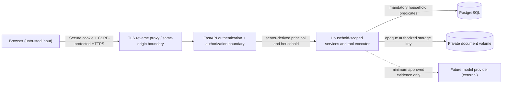

# Security threat model

## Status and scope

This is the HIC-024 security design for the existing financial, document, analytics, tool, and web
surfaces. It records the controls implemented by HIC-025 for optional secure mode.

Local mode remains limited to one trusted household operator on loopback or a trusted private
network. Secure mode adds authenticated household isolation; an untrusted-network deployment still
requires same-origin TLS, encrypted storage, protected backups, edge security headers, monitoring,
and a deployment-specific security review.

## Assets and security objectives

| Asset | Primary objectives |
| --- | --- |
| Transactions, imports, categories, rules, duplicate evidence | Confidentiality, household isolation, integrity, provenance, deletion control |
| Original documents, extracted text, chunks, retrieval results | Confidentiality, household isolation, integrity, retention/deletion, source provenance |
| Credentials, session tokens, CSRF tokens, recovery material | Confidentiality, unforgeability, revocation, short exposure window |
| Deterministic analytics and tool results | Correct household scope, integrity, reproducibility, no unauthorized disclosure |
| AI prompts, tool calls, responses, and citations when added | Household scope, least data, grounding, injection resistance, auditability |
| PostgreSQL, private blob storage, backups, configuration | Least privilege, encryption, availability, recoverability, redaction |
| Audit events | Integrity and usefulness without sensitive payloads |

Availability matters, but confidentiality and household isolation take priority: an ambiguous
identity, ownership, or storage state must fail closed.

## Actors

- **Household owner:** trusted to administer the installation, create the initial account, manage
  household data, and recover the service.
- **Household member:** a future authenticated person limited to their household. HIC-025 may model
  the role but initially exposes only an owner account and no invitation workflow.
- **Local operator:** controls the host, Docker, environment, database, blob volume, reverse proxy,
  backups, and command line. Host compromise is outside application containment.
- **Unauthenticated remote actor:** attempts credential attacks, enumeration, CSRF, malicious
  uploads, denial of service, and access to guessed UUIDs.
- **Authenticated malicious or compromised account:** attempts cross-household access, excessive
  export, destructive actions, or session persistence.
- **Malicious input producer:** controls CSV/PDF content, filenames, descriptions, extracted text,
  and future prompt-injection instructions.
- **External processors:** future model or identity providers. None are trusted with household data
  merely because they are configured.

## Trust boundaries and data flow

Trust changes at the browser/API boundary, at PostgreSQL and blob credentials, and at any future
external processor. UUIDs, filenames, account labels, client-supplied household IDs, and the
`local_single_household` retrieval value are not authorization evidence.

## Threats and required controls

| Threat | Examples | Required controls |
| --- | --- | --- |
| Broken access control / IDOR | Guessing a batch, transaction, category, candidate, document, extraction, or chunk UUID | Derive household from the authenticated session; apply household predicates in the service/repository layer; return the same not-found response for absent and foreign records; test every identifier path |
| Missing indirect scope | A child row belongs to a foreign parent; retrieval or tools join without ownership | Non-null `household_id` on sensitive tables, household-leading indexes, parent/child household consistency constraints, and explicit scope in analytics/tools/retrieval |
| Authentication bypass | Forgotten unprotected route, docs endpoint, dev bypass, spoofed header | Deny-by-default router dependency; only health/login/bootstrap status explicitly public; never trust identity headers without a separately approved trusted-proxy design |
| Credential attack | Brute force, stuffing, weak hashes, user enumeration | Argon2id with reviewed parameters, generic failures, per-account and per-source throttling, bounded input, no secrets in logs, owner-initiated password change and recovery |
| Session theft/fixation | XSS, copied cookie, reused token, long-lived session | 256-bit random opaque tokens; store only SHA-256 token digests; `Secure`, `HttpOnly`, `SameSite=Lax`, host-only cookies; rotate at login and privilege changes; idle and absolute expiry; revoke server-side |
| CSRF and cross-origin abuse | Forged import/delete/category/review request | Same-origin frontend, Origin/Host validation, synchronizer token on every state-changing request, SameSite cookie as defense in depth, no permissive credentialed CORS |
| XSS / unsafe rendering | Transaction or document text rendered as markup | React text escaping, no raw HTML for household content, restrictive Content Security Policy at deployment boundary, dependency review |
| Malicious upload | Oversized/polyglot PDF, formula-like CSV, traversal filename, parser exploit | Existing type/size/shape checks, opaque blob paths, patched parsers, resource limits, no static blob serving, future malware sandbox decision if exposure grows |
| Prompt/tool injection | Document says to ignore policy or call a mutation | Treat content as data, immutable allowlisted tools, server-derived household scope, no model database access, bounded context, injection evaluations, citations and refusal policy in HIC-023 |
| Data leakage through logs/errors | Raw rows, text, prompts, tokens, SQL parameters, provider payloads | Structured allowlisted audit fields, generic external errors, secret redaction, no request-body logging, content-free failure codes |
| Cross-household uniqueness leak | Duplicate/checksum/category conflicts reveal another household | Make relevant uniqueness constraints household-scoped and map conflicts without foreign identifiers |
| Destructive action or replay | Repeated deletion/review/categorization, stolen session | Authorization plus CSRF, transactional/idempotent services, audit event, re-authentication for future export/delete-household operations |
| Resource exhaustion | Large files, broad queries, login floods, extraction/search abuse | Existing size/page/text/result bounds, endpoint throttles, timeouts, concurrency limits, database indexes, body limits at proxy and API |
| Backup/storage disclosure | Copied database, document volume, staging file, retained backup | Encryption at rest, least-privilege OS/database accounts, bounded staging and backup retention, protected recovery keys, restore/deletion exercises |
| Supply-chain compromise | Python/npm image or parser dependency compromised | Lock/review dependencies, high-severity audits, minimal images, rebuild cadence, provenance where available, prompt patching for critical advisories |
| Misconfiguration | Public HTTP, default password, exposed database/docs, debug mode | Startup validation for secure mode, documented reverse-proxy/TLS requirements, no default credentials, restricted PostgreSQL/blob network access, production runbook |

## Authorization boundary matrix

HIC-025 must enforce these rules from a server-derived `RequestPrincipal`; clients never select an
authoritative household.

| Surface | Required boundary |
| --- | --- |
| `/health` | Public liveness only; returns no configuration, identity, dependency, or data detail |
| Login/logout/session status | Public only where necessary; generic authentication errors; logout and password changes are CSRF-protected |
| Imports and transactions | Authenticated household predicate on list, detail, upload persistence, and every filter target |
| Categories, rules, assignments | Authenticated household predicate on catalog, rule, transaction, apply scope, and synchronization writes |
| Duplicate candidates | Both transaction sides and candidate must belong to the principal household; no foreign evidence in errors |
| Analytics HTTP APIs | Services receive household scope and include it before every aggregation or detail selection |
| Analytics tool executor | Orchestrator supplies a server-created principal context; tool arguments cannot contain or override household identity |
| Document upload/metadata/delete | Document ownership checked before metadata, blob access, lifecycle transition, or audit write |
| Extraction/chunking/search | Household predicate applied before source selection, derivative creation, and lexical/vector matching; GIN/vector match never precedes scope |
| Future AI | Only approved minimum tool/retrieval evidence for the principal household; no raw database or blob access; processor disclosure and opt-in required |
| `/docs` and `/openapi.json` | Authenticated in secure mode or disabled at deployment; never a bypass to protected handlers |

## Deployment modes

### Current local mode

- Loopback or trusted private network only; one implicit household; no authentication claim.
- Real data is accepted only with the operator's understanding that every process/client reaching
  the API can access it.
- Public tunnels, port forwarding, shared workstations, and multi-household data are unsupported.

### Future secure mode

- TLS terminates at a trusted same-origin reverse proxy; PostgreSQL and blob storage are private.
- Authentication and non-null household migration are complete; an owner exists; startup has no
  auth bypass.
- Secure cookies, CSRF/origin checks, rate limits, audit redaction, backup controls, and security
  headers are configured and tested.
- Secure mode must fail startup rather than silently fall back to local unauthenticated behavior.

## Residual risks and non-claims

- A compromised host/operator can read application memory, database files, blobs, and secrets.
- Application-managed passwords do not provide phishing-resistant MFA; passkeys or external OIDC
  may be reviewed later.
- Same-household members are not isolated from one another in the first ownership model.
- Native PDF extraction is not a malware sandbox and lexical search may expose all matching text to
  any authorized household owner.
- Encryption at rest does not protect data while the running application or an authorized session
  accesses it.
- HIC-024 is a design review, not a penetration test, compliance certification, or implemented
  control set.

## HIC-024 security review checklist

- [x] Assets, actors, trust boundaries, and deployment assumptions are explicit.
- [x] Current local mode is distinguished from future authenticated secure mode.
- [x] Direct and indirect object authorization paths are enumerated.
- [x] Financial APIs, mutations, tools, documents, extraction, and retrieval are covered.
- [x] Credential, session, CSRF, XSS, upload, injection, leakage, availability, backup, and supply-chain threats are covered.
- [x] Client-supplied household identifiers and UUIDs are rejected as authorization evidence.
- [x] Fail-closed startup and error-enumeration behavior are specified.
- [x] Residual risks and security non-claims are recorded.
- [x] HIC-025 implementation and test gates are defined in the authentication architecture.
